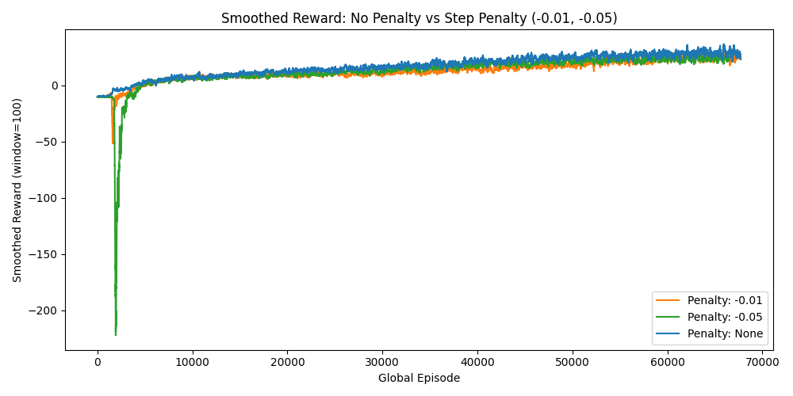
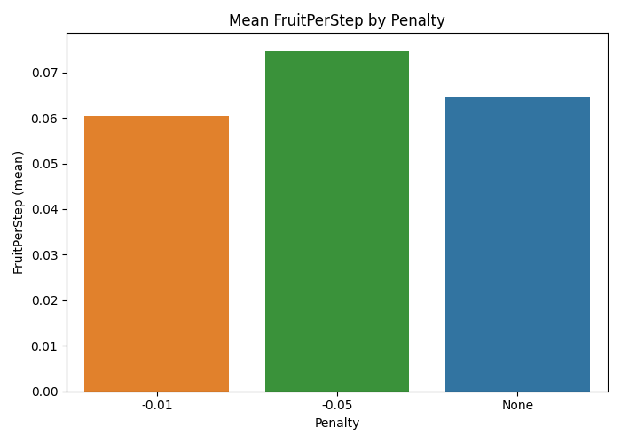

# 🐍 SnakeAI: Deep Reinforcement Learning for Snake Game

*A high-performance DQN agent achieving superhuman performance in the classic Snake game*

## 🏆 Project Highlights

**🎯 Peak Performance:** AI agent achieved a **maximum score of 25** (97+ reward points)  
**⚡ Smart Reward Design:** Advanced step penalty system optimizing for efficiency over survival  
**🔬 Rigorous Analysis:** Comprehensive comparison of reward structures with statistical validation  

---

## 🧠 Intelligent Reward System

This project implements a sophisticated reward structure that goes beyond simple survival:

- **🍎 Fruit Collection:** +5 points per fruit
- **💀 Game Over:** -10 points (intelligent failure penalty)  
- **⏱️ Step Efficiency:** Configurable step penalties (-0.01, -0.05) to encourage optimal paths
- **🏅 Victory Bonus:** +100 points for filling the board

### Key Insight: Step Penalties Drive Intelligence

My analysis revealed that **step penalties fundamentally change agent behavior**, creating more intelligent and efficient gameplay:


*Smoothed reward curves showing how step penalties affect learning dynamics*

  
*Mean fruit collection efficiency by penalty structure - higher bars indicate more intelligent gameplay*

## 📊 Performance Analysis

| Penalty Type | Mean Reward | Max Reward | Efficiency (Fruit/Step) |
|:-------------|------------:|-----------:|------------------------:|
| **None**     | 17.08       | 95         | 0.0647                  |
| **-0.01**    | 12.72       | **97.08**  | 0.0605                  |
| **-0.05**    | 12.71       | 91.65      | **0.0749**              |

**Key Findings:**
- No penalty achieves highest average reward through longer survival
- -0.01 penalty produces the highest peak performance (**25 fruit collected!**)
- -0.05 penalty creates the most efficient gameplay (highest fruit/step ratio)

## 🔧 Technical Architecture

**Deep Q-Network Implementation:**
- **State Space:** 12×12 grid + direction vector + fruit position (150 features)
- **Action Space:** 4 discrete actions (Up, Down, Left, Right)
- **Neural Architecture:** Multi-layer perceptron with ReLU activations
- **Memory:** Prioritized experience replay buffer
- **Optimization:** Adam optimizer with ε-greedy exploration

**Key Technical Features:**
- 🚀 **GPU-Accelerated Training:** CUDA-optimized PyTorch implementation
- 🎮 **Interactive Gameplay:** Real-time AI vs Human comparison
- 📈 **Comprehensive Logging:** Detailed training metrics and analysis
- 🔄 **Vectorized Environment:** Efficient batch processing for faster training

## 🎯 Why This Project Matters

This isn't just another Snake AI - it's a **research-grade implementation** that demonstrates:

1. **Advanced RL Concepts:** Proper reward shaping, experience replay, and exploration strategies
2. **Rigorous Experimentation:** Statistical analysis across multiple reward configurations  
3. **Performance Engineering:** GPU optimization and efficient data structures
4. **Practical AI Development:** End-to-end pipeline from training to deployment

Perfect for demonstrating deep learning expertise in **AI internship applications** or **portfolio reviews**.

---

## 🚀 Quick Start

```bash
# Clone and setup
git clone https://github.com/josanchdev/SlytherNN.git
cd SlytherNN
uv sync

# Watch the AI play (opens pygame window)
uv run main.py
# Press SPACE for AI mode, Arrow Keys for human play
```

**System Requirements:** Python 3.11+, PyTorch, GPU recommended for training

---

*Built with PyTorch • Optimized for CUDA • Analyzed with comprehensive statistical methods*
